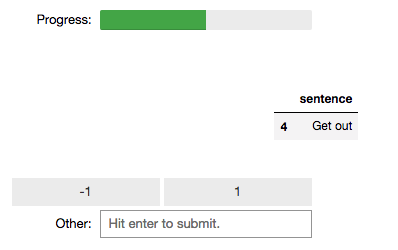

# superintendent


want to semi-supervise your machine learning?

This package is designed to provide a `ipywidget`-based interactive labelling tool for your data.

### Installation

```
pip install superintendent
```

If you want to also use the keyboard shortcuts for labelling faster, you will
also have to enable the ipyevents jupyter extension:

```
jupyter nbextension enable --py --sys-prefix ipyevents
```

### Usage

```python
from superintendent import SemiSupervisor

example_df = pd.read_csv('https://raw.githubusercontent.com/janfreyberg/superintendent/master/example_test.csv')

print(example_df)
```

```
               sentence  sentiment
0     This is terrible.         -1
1        This is great.          1
2           Outrageous!         -1
3  I don't believe you.          1
4               Get out          1
5     I love the anger.         -1
```

This is a small & silly example dataframe, but as you can see, the labels aren't
right (e.g. `Get out.` is labelled positive). So let's create some new labels.

```python
widget = SemiSupervisor(example_df[['sentence']], example_df[['sentiment']])

widget.annotate()
```



Once you've clicked through and done all your labelling, you can get your new
labels from the widget:

```python
print(widget.new_labels)
```

```
  sentiment
0        -1
1         1
2        -1
3        -1
4        -1
5         1
```

### Making labelling more efficient

`superintendent` uses `ipyevents` to capture keystrokes while you are hovering
your mouse over the widget. This means you can use
