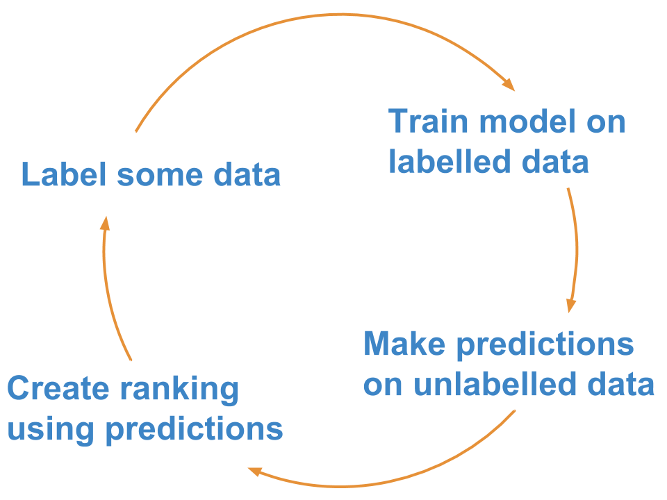

# Active learning with `superintendent`

## What is active learning?

[Active learning](https://en.wikipedia.org/wiki/Active_learning_(machine_learning)) is a
semi-supervised machine learning approach that involves labelling data to optimally train
a machine learning model.

This means a human and a machine learning algorithm interact, with the human labelling
cases the machine learning algorithm is most unsure about.

A common implementation is what is known as "pool-based" active learning:
You label a few cases, train your model, make predictions about the unlabelled data, and
then label the points for which your model is not (yet) producing high-probability
predictions.

The rough steps are:



This approach is generally more efficient than labelling data points at random, and it
allows you to reach a better model performance faster.

## Active learning in `superintendent`

The active learning process in superintendent is easy. `superintendent` is designed to work
with any machine learning model that outputs continuous probabilities and follows the [scikit-learn](https://scikit-learn.org/stable/)
interface (i.e. the model implements a `fit` and `predict_proba` method).

You then simply pass the model, as well as a method of re-ordering the data, to a `superintendent`
widget. This then gives you a button that allows you to re-train a model.

To demonstrate this, we'll create manual labels for the MNIST dataset, which we can download using scikit-learn's datasets module. For simplicity, we will only use the first 500 images.

```{jupyter-execute}
from sklearn.datasets import load_digits
digits = load_digits().data[:500, :]

print(digits.shape)
```

These are 8x8 pixel images, but the 64 pixels have been "flattened" into the second array dimension, which we can undo:

```{jupyter-execute}
digits = digits.reshape(-1, 8, 8)
print(digits.shape)
```

To label this data, we need a "data annotation" widget. Superintendent does not ship the functionality to annotate data itself. Instead, it is designed to work with separate, modular data annotation widgets. In particular, the `ipyannotations` library, which is maintained by the same people, works well:

```{jupyter-execute}
from ipyannotations.images import ClassLabeller

annotation_widget = ClassLabeller(
    options=[f"{i}" for i in range(10)],
    image_size=(256, 256),
    allow_freetext=False)

annotation_widget.display(digits[0])
annotation_widget
```

For `superintendent`, we will use this annotation widget to actually collect labels. However, first we need to think about how we are going to use machine learning to make this easiest.

Now, in most applications these days, you would likely classify images using a convolutional neural network. But for now, we can take a stab at
it using a simple logistic regression model, which isn't great, but fairly good.

```{jupyter-execute}
from sklearn.linear_model import LogisticRegression

model = LogisticRegression(
    solver="lbfgs",
    multi_class="multinomial",
    max_iter=5000
)
```

In addition, all scikit-learn models expect data to be "rectangular". This means we need to preprocess the data that goes into our model. We can pass an arbitrary pre-processing function to superintendent - as long as it accepts the features and labels, and returns the transformed features and labels:

```{jupyter-execute}
def preprocess_mnist(x, y):
    return x.reshape(-1, 64), y
```

Now that we have a dataset, an interface to label this dataset, as well as a supervised machine learning 
model we want to train on our dataset, we can pass both to `superintendent`'s `ClassLabeller`. This will create an interface for us to label data, retrain our model, *and* benefit from active learning.

Since we are using images, we can use the `from_images` class constructor
that sets the correct display function for us.

```{jupyter-execute}
from superintendent import Superintendent

data_labeller = Superintendent(
    features=digits,
    model=model,
    labelling_widget=annotation_widget,
    acquisition_function='entropy',
    model_preprocess=preprocess_mnist
)

data_labeller
```

Whenever you re-train a model, if you have also specified the `acquisition_function` keyword argument, the data will be automatically re-ordered in a way prioritise the optimal subsequent data points.

Additionally, the widget will display your accuracy on the data you have already labelled. This is evaluated as the mean model score across three folds of cross-validated evaluation.

## Active learning strategies

```{autosummary}
   ~superintendent.acquisition_functions.entropy
   ~superintendent.acquisition_functions.margin
   ~superintendent.acquisition_functions.certainty
```

You can implement your own strategy: the functions should simply take in a numpy array (shape *n_samples, n_classes*) of probabilities of each class for each sample, and return a ranking of the rows of that array.

For example, if sorting by margin, an input of:

| 0    	| 1    	| 2    	|
|------	|------	|------	|
| 0.1  	| 0.8  	| 0.1  	|
| 0.3  	| 0.3  	| 0.4  	|
| 0.33 	| 0.33 	| 0.34 	|
| 0.01 	| 0.01 	| 0.98 	|

Should produce an output of:

```
[2, 1, 0, 3]
```

because the third entry has the lowest margin, then the second entry, then the first, and then the last.

## Active learning for multi-output widgets

When you pass a model into a multi-labelling widget, `superintendent` will wrap your model in a 
[MultiOutputClassifier](https://scikit-learn.org/stable/modules/generated/sklearn.multioutput.MultiOutputClassifier.html)
wrapper class.

The active learning strategy will average the metric used for prioritisation (e.g. certainty,
margin) across the different classes.

## Preprocessing data before passing it to the model

In general, you will often want to pass different parts of your data to your display function
and your model. In general, superintendent does not provide "pre-model" hooks. Instead, any
pre-processing that is specific to your model or your display function, can be specified in
the `display_func`, or in a
[scikit-learn Pipeline](https://scikit-learn.org/stable/modules/generated/sklearn.pipeline.Pipeline.html)
object.

You can find an example of this [here](examples/preprocessing-data.ipynb)

## What model to choose

The choice of model is ultimately driven by the same factors that should drive
your model choice if you had a complete set of labelled data and wanted to build
a supervised machine learning model.
