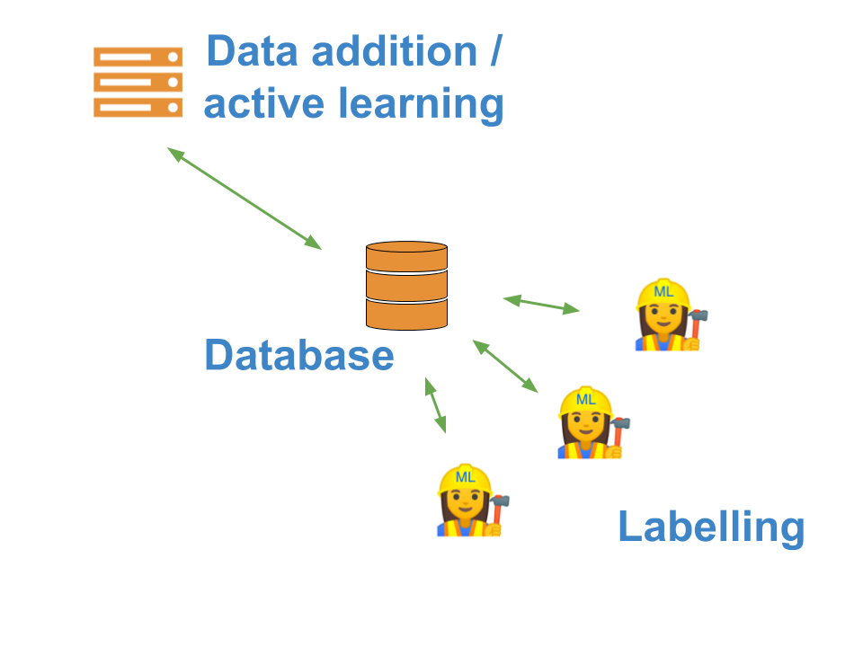

# Scaling labelling and active learning

One of the main challenges about labelling data is that it can take a lot of time.

To get around this, many people want to distribute the task across multiple people - potentially even outsourcing it to a crowd platform - and this is challenging using a standard in-memory python object.

In `superintendent`, you can get around this by using the `superintendent.distributed` submodule. The labelling widgets effectively replicate the widgets in the main `superintendet` module, but do so using a database to store the "queue" of objects, as well as the results of the labelling.

The distributed submodule stores and retrieves data from a SQL database, serialising / deserialising it along the way. You simply pass your data in the same way you do with `superintendent` widgets, and can retrieve the labels in the same way. In theory, other than having to set up the database, everything else should be the same.

```{warning}
   For demonstration purposes, this example uses an SQLite file as a database. However,
   this is unsuitable for real distribution of labelling, as if it is on a shared
   file-system, it will break. In production, a database server is recommended.
   In the past, superintendent has been used successfully with PostgreSQL, but any
   database that works with SQLAlchemy should work.
```

The component diagram looks a bit like this:



This allows you to ask your colleagues to label data for you. By removing the labelling process from the active learning process, it also allows you to scale the compute that does the active learning, e.g. use a server with GPUs to train complex models, while the labelling user can just use a laptop.

Ultimately, the database architecture also means that you have more persistent storage, and are more robust to crashes.

## Distributing the labelling of images across people

`superintendent` uses [SQLAlchemy](https://www.sqlalchemy.org/) to communicate with the database, and all you need to provide is a ["connection url"](https://docs.sqlalchemy.org/en/latest/core/engines.html#database-urls).

First, we make sure that we are using a completely fresh database:

```{jupyter-execute}
import os
if os.path.isfile("demo.db"):
    os.remove("demo.db")
```

Then, we can load the MNIST data using scikit-learn. To make sure we display them correctly, we'll also define a pre-processing function that
reshapes the data:

```{jupyter-execute}
from sklearn.datasets import load_digits
import numpy as np
digits = load_digits().data.reshape(-1, 8, 8)
```

To create a "distributed" superintendent widget, all we have to do is import it from the `distributed` submodule, and pass a database connection string:

```{jupyter-execute}
from superintendent import Superintendent
from ipyannotations.images import ClassLabeller

annotation_widget = ClassLabeller(
    options=[f"{i}" for i in range(10)],
    image_size=(256, 256),
    allow_freetext=False)

widget = Superintendent(
    connection_string="sqlite:///demo.db",
    labelling_widget=annotation_widget,
)
```

We can then add data to the database. Because every widget connects to the DB, we should only run this code once:


```{jupyter-execute}
widget.add_features(digits[:1000, :])
```

We can then start labelling data by displaying the widget:

```{jupyter-execute}
widget
```

You can inspect by using the `widget.queue` attribute, which encapsulates the database connection and the methods for retrieving and submitting data.

```{jupyter-execute}
#from pprint import pprint

#with widget.queue.session() as session:
#    pprint(session.query(widget.queue.data).first().__dict__)
```

As you can see, `superintendent` added our entries into the database. The format of this row is not necessarily important, as you can retrieve the data needed using `superintendent` itself - this will convert it back to python
objects.

For your information, data is serialised as JSON, with custom JSON encoders for numeric data such as numpy arrays
or pandas objects.

## Retrieving data from the distributed widget

Any `superintendent` connected to the database can retrieve the labels using `widget.new_labels`:

```{jupyter-execute}
pprint(widget.new_labels[:30])
```

## Doing active learning during distributed labelling

One of the great benefits of using the distributed submodule is that you can perform active learning, where the labelling of data and the training of the active learning model are split across different machines. You can achieve this by creating a widget object that you don't intend to use for labelling - only for orchestration of labelling by others. First, you run create the widget as normal:

```{jupyter-execute}
from sklearn.linear_model import LogisticRegression

model = LogisticRegression(
    multi_class='auto',
    solver='lbfgs',
    max_iter=5000
)

widget = Superintendent(
    connection_string="sqlite:///demo.db",
    features=digits[:1000, :],
    labelling_widget=annotation_widget,
    model=model,
    model_preprocess=lambda x, y: (x.reshape(-1, 64), y)
)
```

```{jupyter-execute}
:hide-code:
target = load_digits().target
for i in range(300):
    widget._apply_annotation(str(target[i]))
```

Then, you call `orchestrate` on it:

```{jupyter-execute}
widget.orchestrate(interval_seconds=None)
```

```{note}
   By default, the orchestration runs forever, in regular intervals. The interval can be specified as either seconds (`interval_seconds`), or number of labels created (`interval_n_labels`). You might not want repeated orchestration - for example, you may instead want to run orchestration using cron scheduling. You can do that the way I am doing it above: by passing
   ``None`` as the ``interval_seconds`` keyword argument.

   In either case, the orchestration is best run from a python script from the command line, rather than from
   a jupyter notebook.
```
