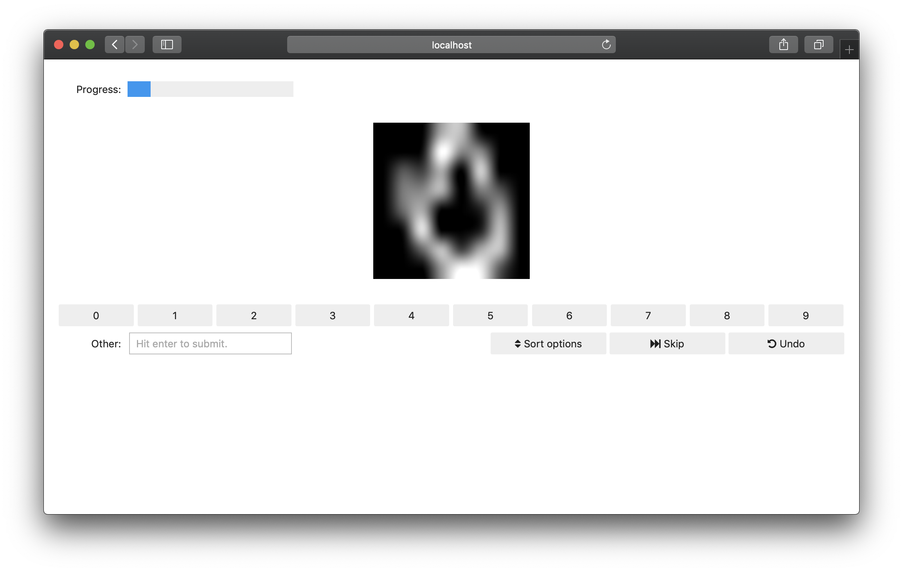
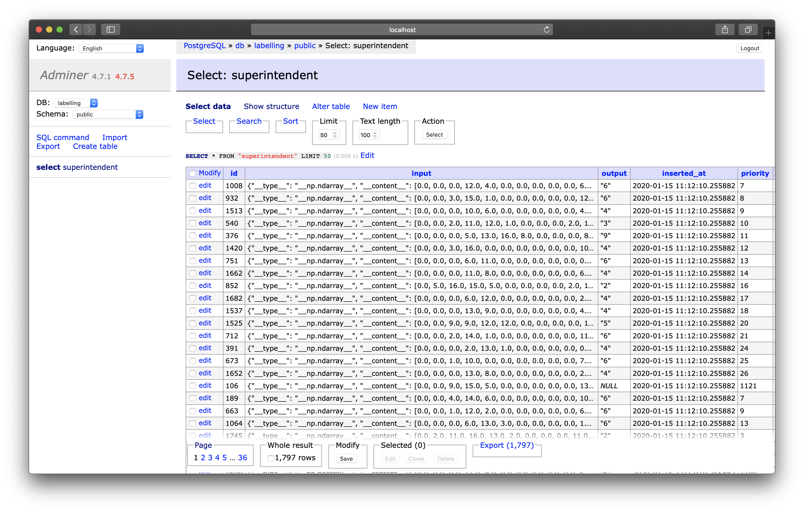

# Using docker-compose to serve a superintendent interface to many users

The documentation already shows how distributed labelling using a SQL database
to distribute the data can be used pretty effectively (see
:doc:`../../distributing-labelling`).

However, setting up a database can be difficult; and although even for hundreds
of labellers even a small database instance would suffice, there will be some
costs associated with it in the cloud.

However, more and more organisations have [docker](https://www.docker.com/)
running on a server; and even if your organisation does not have their own
hardware or runs docker in the cloud, all of the popular cloud providers offer
docker (and, in particular, `docker-compose`) as a service.

This means it becomes relatively easy for you to manage a database as a
back-end, a jupyter server as a front-end, and a model-training server to
support active learning.

## docker-compose

Docker-compose allows you to specify "multi-container" (i.e. multi-machine)
applications that you can then all start and stop at the same time.

You should make sure you have docker and docker-compose installed before
continuing.

Here, we are going to start four machines, and the configuration file will
look like this:

.. literalinclude:: docker-compose.yml

Let's go through each item.

- db

  The database server. This will use an official
  (PostgreSQL)[https://www.postgresql.org/] docker image. You can see that we
  are providing a "volume", meaning all the data inside the database is stored
  in the directory `./postgres-data`.

  .. note::
     The username / password here are just as examples; and you should use some
     randomly generated strings for safety.

- adminer

  this is purely to be able to have a graphical interface to the database.

- notebook:

  This is the server that will actually server our notebook as a website. It
  uses an image called voila - which actually doesn't exist yet; we will create
  that soon.
  
  Note that we're placing a notebook into the home folder; this means the
  container will know what to serve

  Note also that we're giving this server the **same** environment variables
  as the databse server (which we captures using `&environment`)

- orchestrator

  This server will run an orchestration script (which we are mounting as a
  volume) that will re-train and re-order the data in the database.

## The notebook (our webapp)

To make superintendent read from the database and display the images (we'll be
using MNIST again...), we need one notebook with the following content:

`./voila-interface.ipynb`

```python
import os
from superintendent.distributed import ClassLabeller

user = os.getenv('POSTGRES_USER', "superintendent")
pw = os.getenv('POSTGRES_PASSWORD', "superintendent")
db_name = os.getenv('POSTGRES_DB', "labelling")

db_string = f"postgresql+psycopg2://{user}:{pw}@db:5432/{db_name}"

widget = ClassLabeller.from_images(
    canvas_size=(200, 200),
    connection_string=db_string,
    options=range(10),
    display_preprocess=lambda x: x.reshape(8, 8),
)
widget
```

## The orchestration script (our machine learning model)

This script will look *very* similar to our notebook, but we will additionally
create our machine learning model. This time, we will use a neural network,
using keras.

.. literalinclude:: orchestrate.py

.. note::
   In this case, we are adding the data for the images straight into the
   data-base. This means the ``numpy`` array is serialised using JSON. If your
   images are large, this can be too much for the database. Instead, it's
   recommended that you only place the *filepaths* of the image into the
   database.

## Dockerfiles

Then, we need to actually build two docker images: one that will run the web
application, and one that will run the orchestratrion:

### Web application (voila) dockerfile

.. literalinclude:: voila.Dockerfile

### Model training dockerfile

.. literalinclude:: tensorflow.Dockerfile

## Starting

At this point, our folder structure should be:

```
.
├── docker-compose.yml
├── orchestrate.py
├── voila-interface.ipynb
├── tensorflow.Dockerfile
└── voila.Dockerfile
```

Now, we can run `docker-compose up`, which will:

1. build the docker images specified in docker-compose.yml
2. start the four different docker images

Now, if you visit [http://localhost:8866](http://localhost:8866), you will
be able to start labelling. And, of course, if you do this on a web-server,
you'll be able to point other people to that address, so they can start
labelling too.



As you and your colleagues proceed with the labelling, you can inspect the
content of the database at [http://localhost:8080](http://localhost:8080), the
"adminer" interface (a web interface to inspect databases). Make sure to set
"System" to PostgreSQL when you log in.


